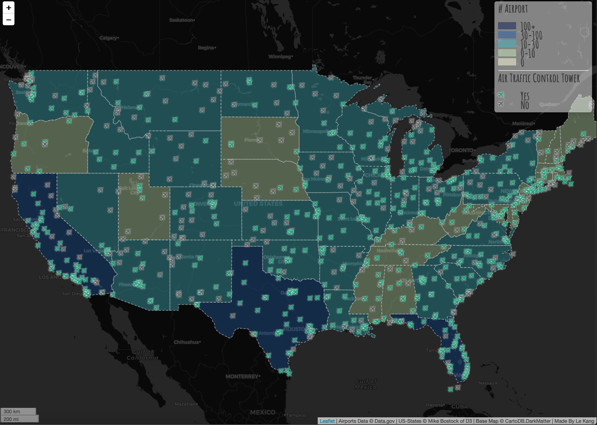
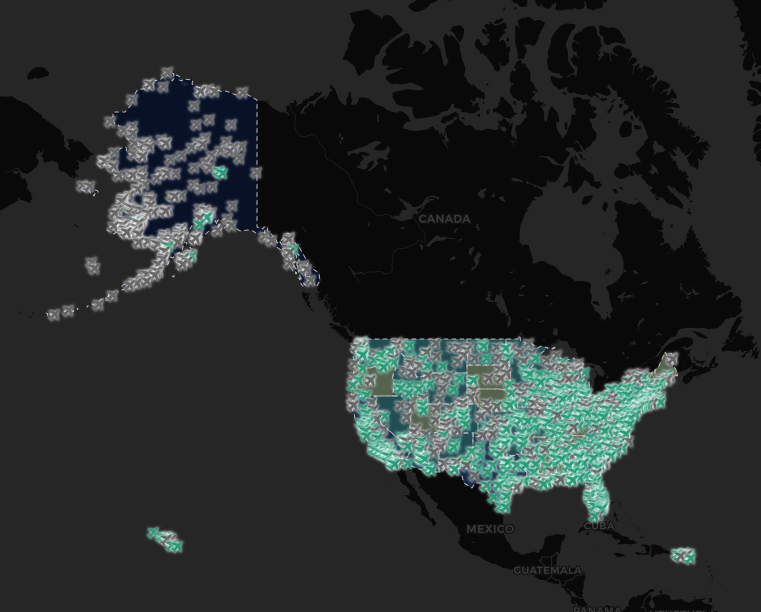

<h2>Airposts in the U.S.</h2>

<b>Introduction</b>

This map shows all the airports locations in the U.S in 2012.

For easy viewing, I zoomed the map to the main island of the United States. If you zoom out the map, you can see the area from other parts of the United States.

<b>Functions</b>

* Understand the general infomation about the airports in the United States.
* The choropleth map to make people clearly see the degree of total airports in each state.
* Different colored icons to distinguish whether the airport has an air traffic control tower.
* By clicking the icon, people also could learn the airport's name.

<b>Libraries</b>

Font: https://fonts.google.com/
Icon: https://fontawesome.com/
Basemap: https://leaflet-extras.github.io/leaflet-providers/preview/

<b>Data Sources</b>

`airports.geojson` <https://catalog.data.gov/dataset/usgs-small-scale-dataset-airports-of-the-united-states-201207-shapefile>

`us-states.geojson` [Mike Bostock](http://bost.ocks.org/mike) of [D3](http://d3js.org/)

<b>Acknowledgment</b>

Thanks Prof. Zhao's tutorial for this repository. 
